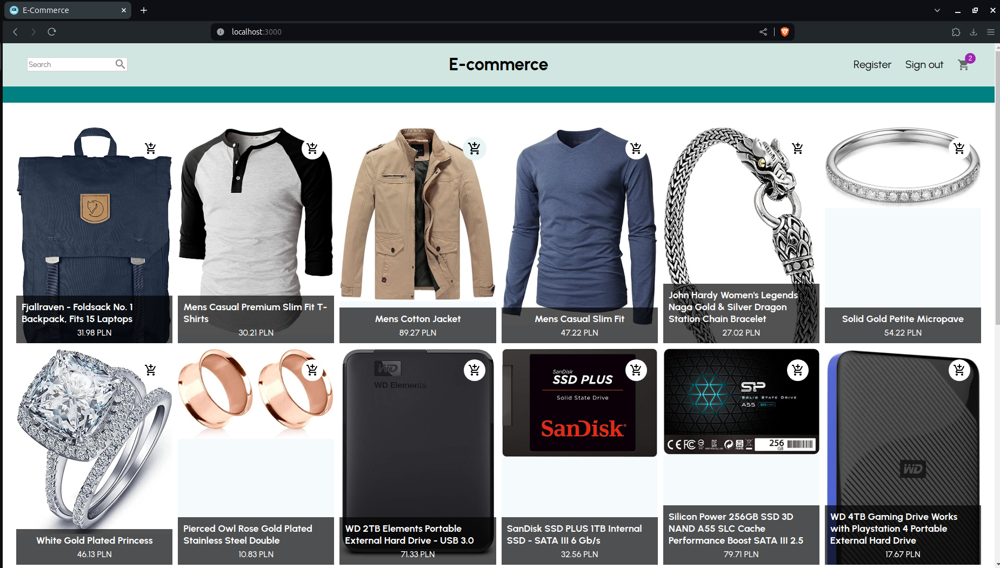
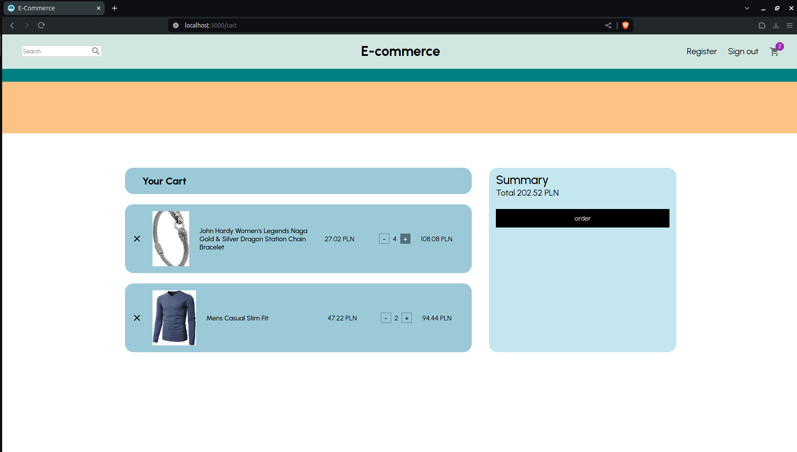
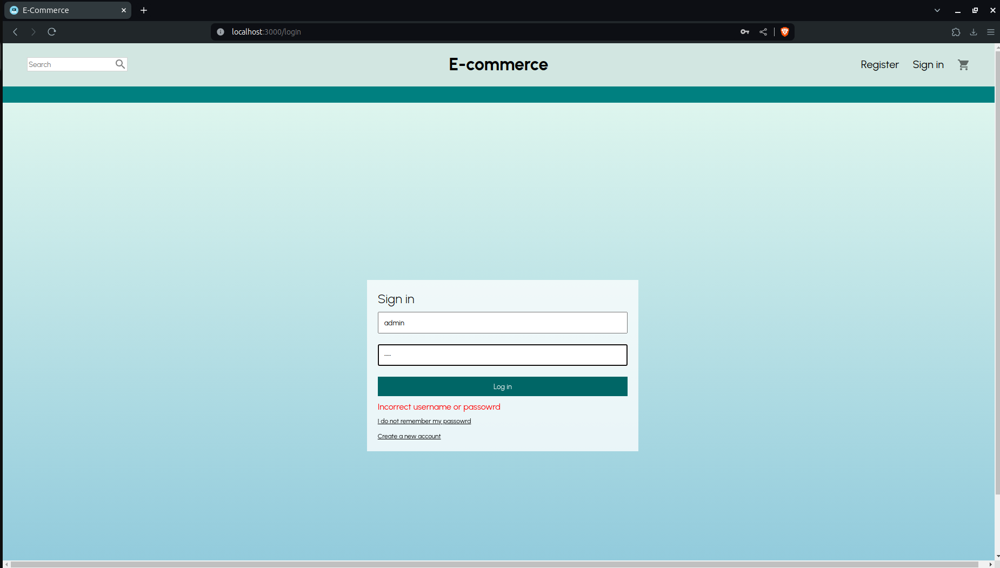

# E-commerce website

Simple website representing online shop built with React

## Installation and setup

In order to make app working correctly you need to implement/use backend api. You can find simple backend api with appropriate endpoints created for this project here: [django e-commerce api](https://github.com/fabiangro/django-e-commerce-api)

Specify your api details in requests.js file or use the one linked above.

After cloning repository:
```bash
npm i
npm run start
```
## Some screenshots
Database state (products from screenshots) was taken from https://fakestoreapi.com/





## Used technologies
* [Node](https://nodejs.org/en)
* [React](https://react.dev/)
* [React Router](https://reactrouter.com/en/main)
* [React Redux](https://react-redux.js.org/)
* [Redux Toolkit](https://redux-toolkit.js.org/)
* [Axios](https://www.npmjs.com/package/axios)
* [tailwindcss](https://tailwindcss.com/)
